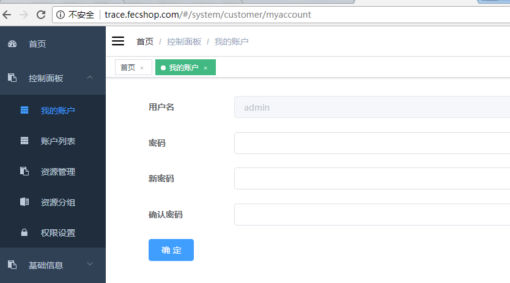
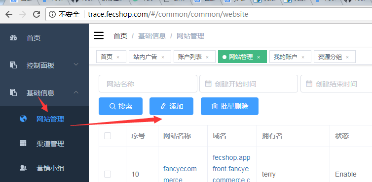
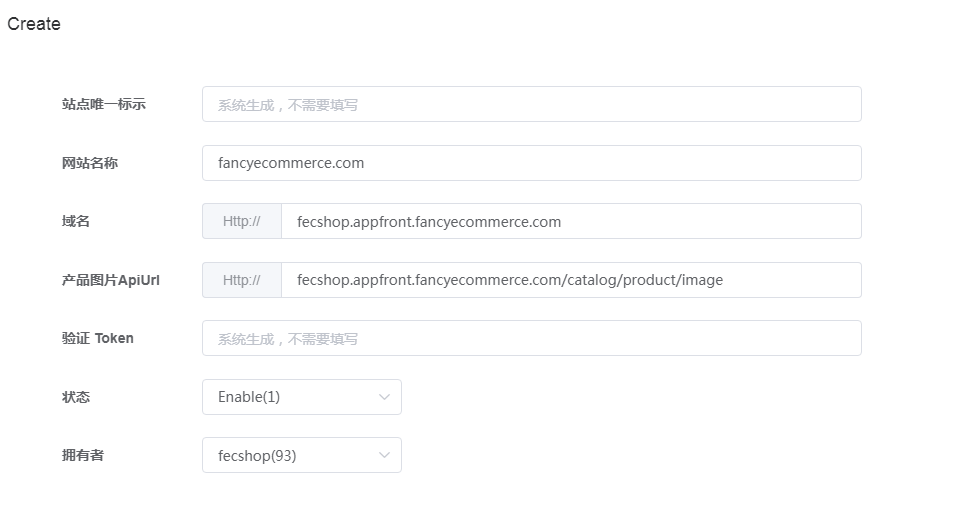
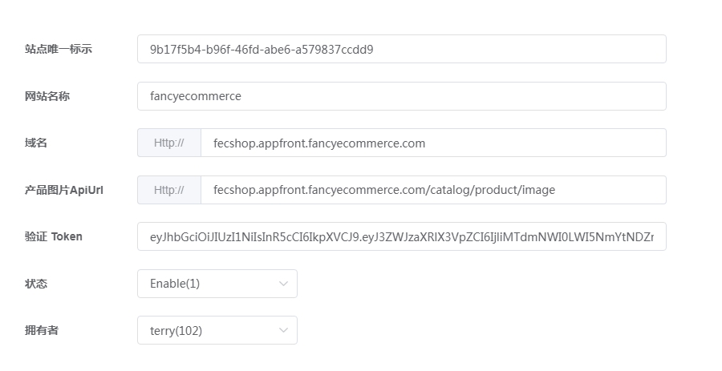

FA 如何添加网站
====================

关于 FA 账户系统，参看:FA 后台账户介绍](trace-fecshop-account.md)


### 前序

登录您的admin 超级账户

1.更换语言

登录后，您可以通过右上角的`A`图标进行语言的切换，切换成中文


2.修改admin的密码

控制面板 -->  我的账户



默认账户是  `admin  fecshop1234` , 您修改成您自己的账户

如果账户不对，您可以打开数据库的 `customer` 表，将
username为admin的这条数据的password，替换成`cc03e747a6afbbcbf8be7668acfebee5`，
也就是执行sql

> 因为有时候进行sql更新，密码错乱导致，通过下面的sql修改一下即可。

```
update customer set password = 'cc03e747a6afbbcbf8be7668acfebee5' where username = 'admin'
```

修改之后的admin的密码为  test123


### 添加网站


1.进入菜单，如图




2.填写信息，如图



> 图片可能和实际不一致，此处多了一个拥有者选项，这个已经去除，图片没有更新，
包括后面的图片，或多或少都有有一点不一致，因为FA进行了改动。

下面是说明：

`站点唯一标示`：不需要填写

`网站名称`：填写你的名站的名称，自定义即可

`域名`：填写您的网站域名即可，如果您有多个，填写其中一个即可，fecshop.appfront.fancyecommerce.com
这里就是做一个记录


`产品图片ApiUrl`：通过sku获取图片文件的地址，这个就是fecshop的pc端地址，譬如：
fecshop.appfront.fancyecommerce.com/catalog/product/image，
您将 `fecshop.appfront.fancyecommerce.com` 切换成您的域名即可。

`验证 Token`： 系统生成，不需要填写

`状态`：设置成enable


填写完成后，保存即可完成


点击编辑，弹出编辑框，可以看到生成的
`验证token` 和网站唯一标示



> 对于按钮 `js代码`，目前没有太大的用户，因为fecshop已经在代码中默认打点，
这些js已经默认嵌入了，您不需要自己在各个页面添加js打点和php发送数据。


