Fecmall Google Analysis和GTM设置
==============

> google analysis  和 google tag manager的设置

### Google Analysis

1.获取ga的追踪js代码

当您在ga添加了网站域名后，就可以获取追踪js代码了，如图：

如图，下面就是js代码

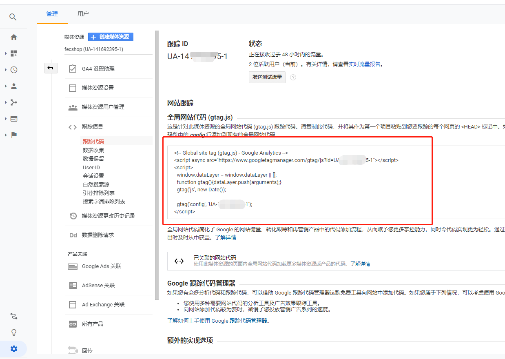

您可以在fecmall后台，将其添加到网站中，[如何在fecmall后台添加追踪js代码](http://www.fecmall.com/doc/fecshop-guide/instructions/cn-2.0/guide-fecmall_trace_js.html)

### Google Tag Manager

Google Tag Manager是一个管理工具，可以将很多追踪js集成进去

跟踪代码管理器文档：https://developers.google.com/tag-manager

如果您使用GTM，那么就不需要将GA的js代码添加到fecmall中，只需要将GTM的代码添加到fecmall后台就可以了

1.获取GTM的js片段，并添加到fecmall中

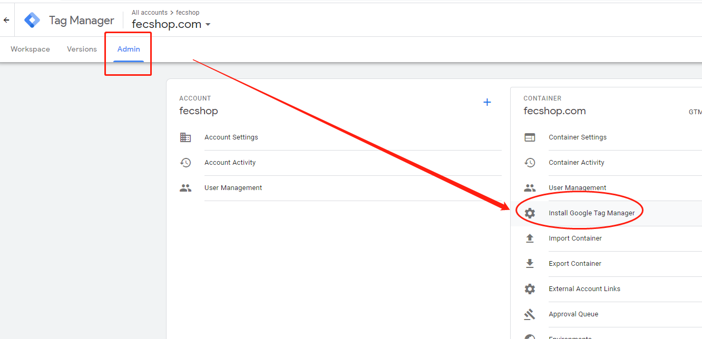

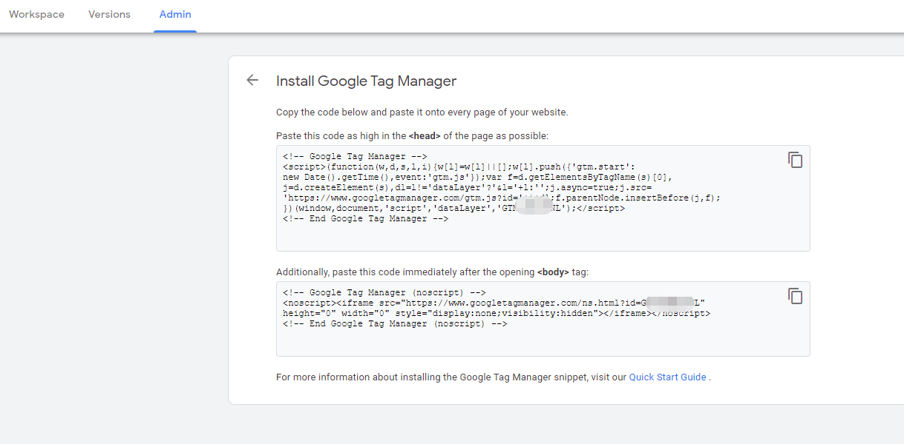

将这个js片段添加到fecmall后台即可（2个js片段，都放进去即可）

您进入fecmall的pc和h5商城，浏览器查看html源代码，检查一下GTM的js片段是否添加成功（html源码中存在，就代表添加完成了）

2.GTM绑定ga

Add New Tag

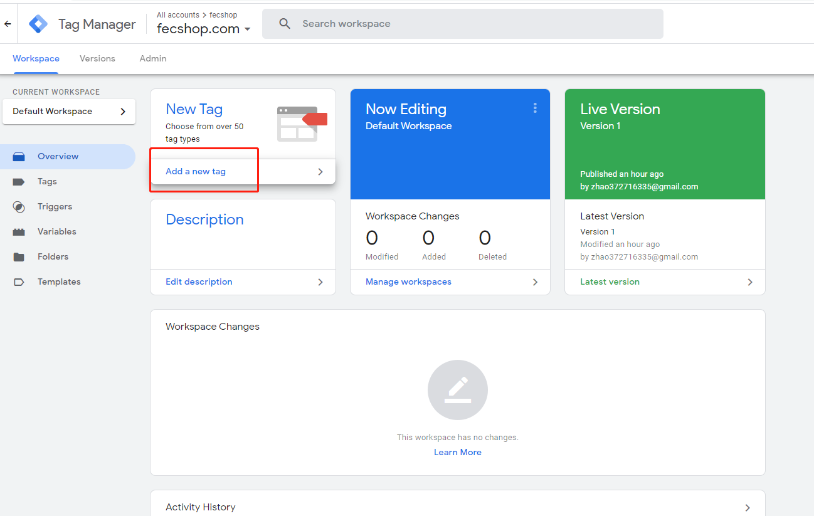

弹出具体的框

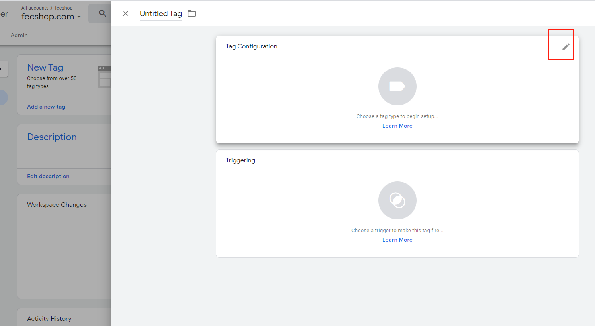

点击编辑按钮

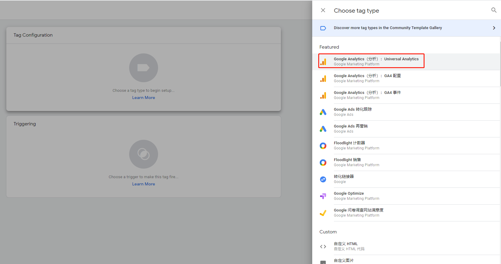

点击选择后，按照下图，填写内容，注意，一定严格按照下面的内容填写，否则pc和m端的多个子域名会出问题，譬如
（pc:www.fecshop,  手机：m.fecshop.com）

开启电子商务，启用增强型电子商务功能

选择tagging，也就是触发条件

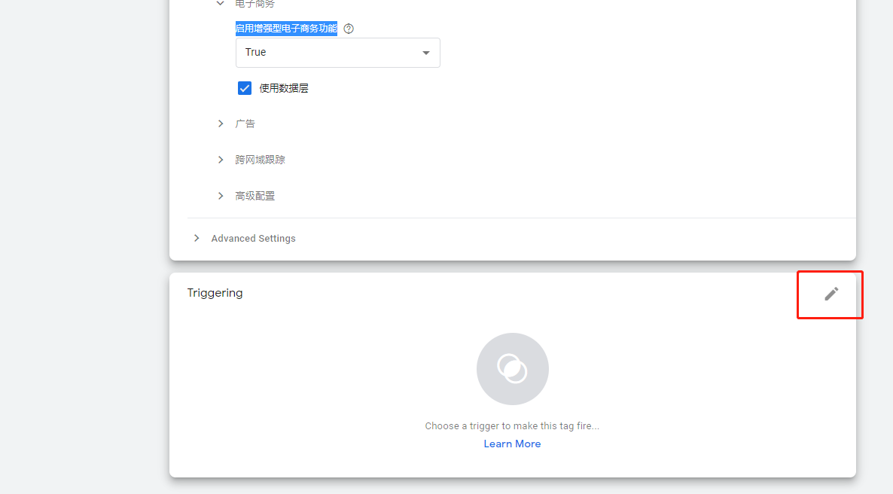

点击 `All Page` 也就是所有的页面都出发

点击 `save`按钮

填写tag名称，这样new tag就添加完成了。

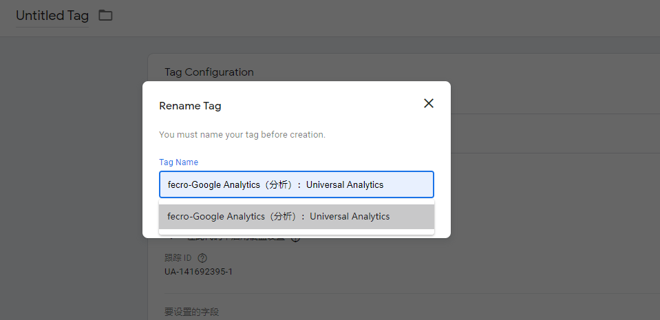

3.tag 发布

新建好的tag，弄完后，需要进行发布，才能生效

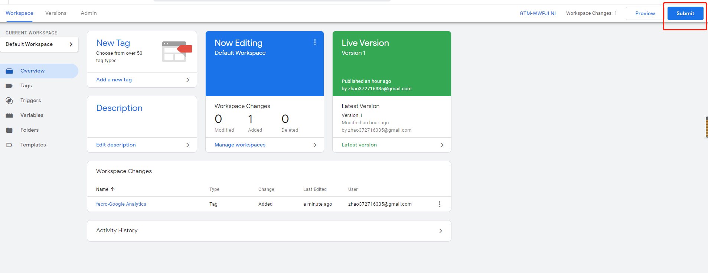

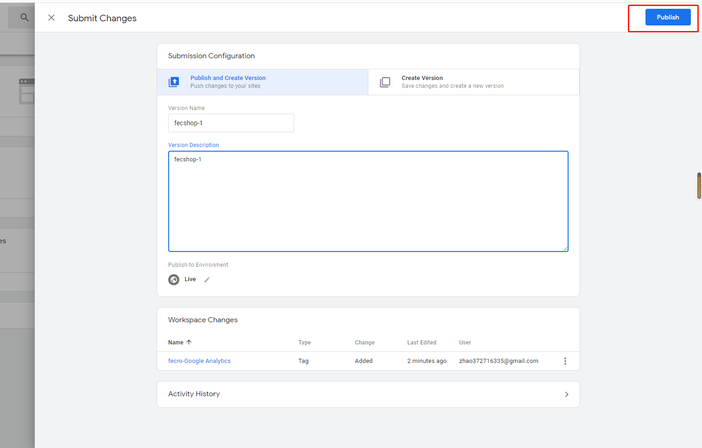

这样就发布完成了。

4.fecmall多个域名使用不同的子域名的问题

由于pc和m端，都是不同的子域名，譬如  www.fecshop 和  m.fecshop.com
，因此需要进行设置

在GTM添加GA js代码片段的时候我们设置了：（这里只是重复说明一下，下面图的内容，我们在上面已经设置了，不需要重复设置）

然后，GA开启电子商务

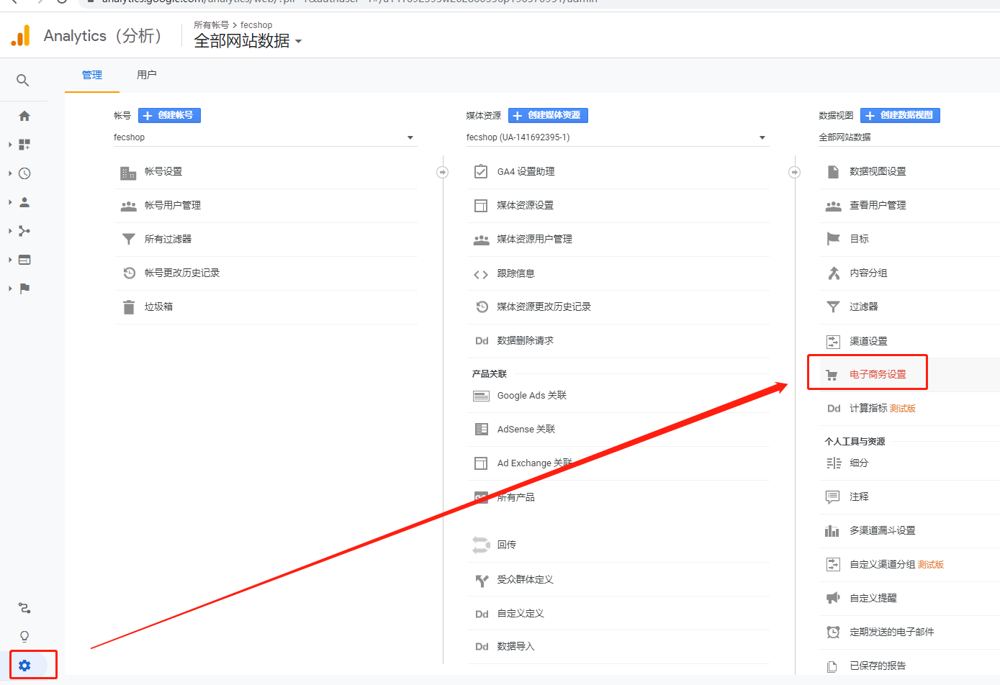

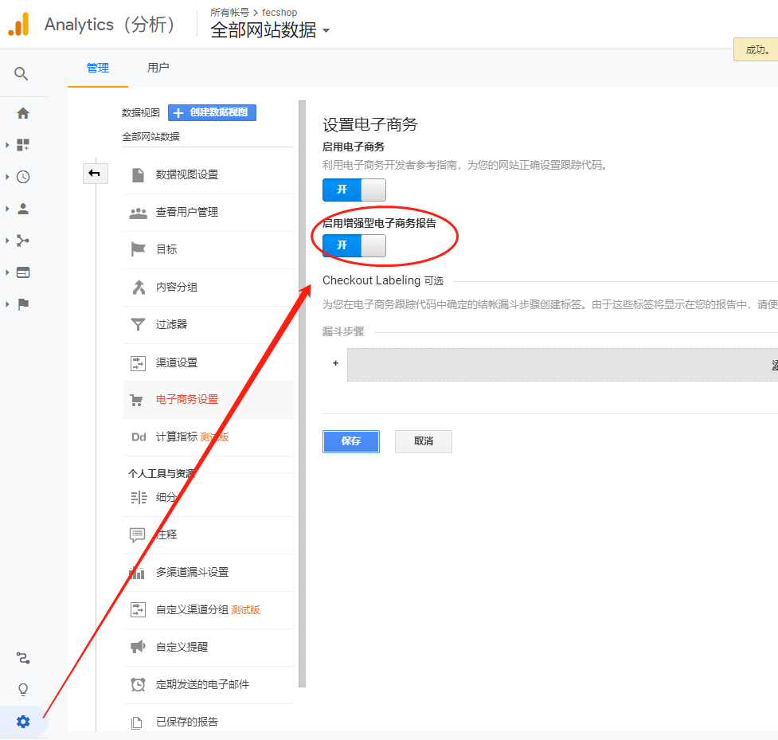

然后，我们需要到GA，`添加引荐排除列表`

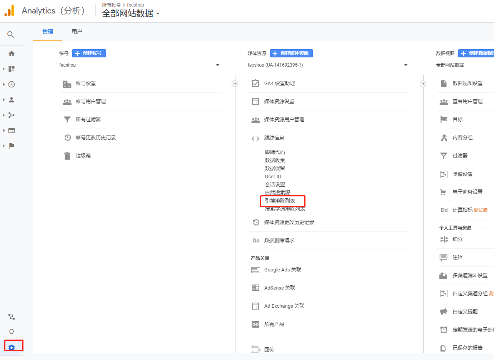

将没有前缀的域名填写上去即可，如果已经存在，则不需要更改

参考资料：https://www.clickinsight.ca/blog/cross-domain-subdomain-tracking-gtm

到这里GTM中添加ga js片段，就完成了，您可以访问一下您的商城，然后看一下ga的实时数据，是否有数据，
pc和h5两个不同的子域名，是否都有数据。

如果没有数据，回去仔细看看文档内容，是不是哪里设置错了，还是tag没有发布，尤其一定要确认tag已经发布，否则没有数据。

